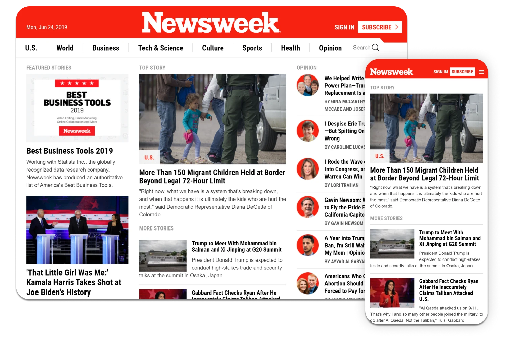

<h1 align="center">Welcome to Newsweek Clone 👋</h1>

  
  

> A clone of [Newsweek](https://www.newsweek.com/) website page, using Bootstrap framework.

### ✨ [Demo](https://nazeh.github.io/newsweek_clone_bootstrap/)

### Built With:
* HTML5
* CSS3
* Bootstrap
* Sass

## Author

👤 **Nazeh**

* Website: [nazeh.me](https://www.nazeh.me/)
* Twitter: [@arnazeh](https://twitter.com/arnazeh)
* Github: [@nazeh](https://github.com/nazeh)
* LinkedIn: [@arnazeh](https://linkedin.com/in/arnazeh)

## Show your support

Give a ⭐️ if this project helped you!
